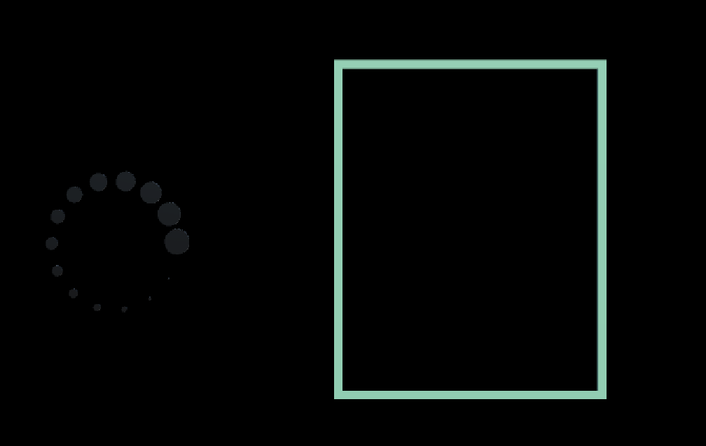

# ToxiReality

## Lien du Gantt prévisionnel du projet :

https://ucafr-my.sharepoint.com/:x:/g/personal/remi_regnault_etu_uca_fr/Ebpxchf4KvxMp6Hno-yty0sBfCtPzfHbdZjBeyyyySWmdA?rtime=8EJzT9zA20g

## Lien des diagrammes
https://drive.google.com/file/d/1syouzhHskRiEKGd3hykM9m2gDZVCTozl/view?usp=sharing

## UI

## Prochaine étape
[x] Avoir un script de reconnaissance facial qui fonctionne
[x] Avoir un project avec mrtk fonctionnel
[x] Avoir une première version de l'UI
[] Lien entre le script de reconnaissance faciale et le project Unity  
[] Modifier la taille des mesh de l'UI en fonction des valeurs donné par le script de reconnaissance faciale  

